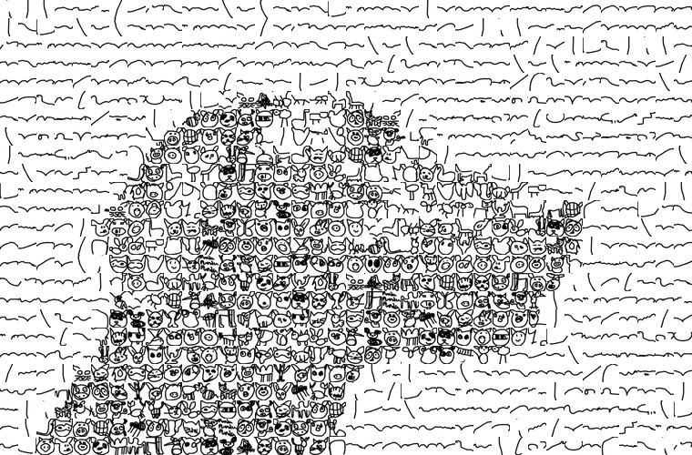
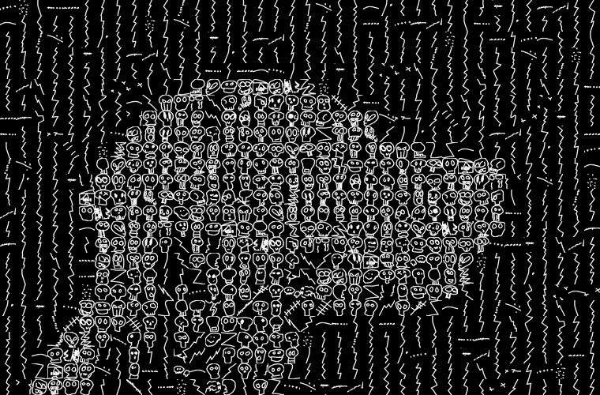

# Mosaic builder building photomosaic-style mosaics intended for use with pen plotters.




Currently works with images from the Quick Draw dataset at https://quickdraw.withgoogle.com/data

This code is derived from code used to make raster photomosaics originally written for the book Flickr Hacks. I've added additional scripts to produce raster thumbnail previews of what the various doodles look like when drawn in black or white ink.  These thumbnails are used by the build_mosaic script to construct a raster photomosaic in the usual way (by selecting thumbnails that match the desired target picture).  Once the appropriate doodles are selected, information about the tileset is output to a JSON file and a JPG preview is made from the thumbnails.  The saved JSON data can then be used, in conjunction with the original binary files from Quick Draw, to produce an SVG which can be plotted.

## Required software packages:
```
PIL/Pillow 2.0+       (https://pypi.org/project/Pillow/)
svgwrite   1.0+       (https://pypi.org/project/svgwrite/)
gsutil                (see https://cloud.google.com/storage/docs/gsutil_install)
```

## Scripts
```
make_sample.sh       # make a sample mosaic from scratch (illustrates use of the following scripts)

get_bins.py          # download a collection of bin files from quickdraw
make_thumbs.py       # produce raster thumbnail images for an image set
mix_thumbs.py        # mix thumb lists into compound lists for mosaics with multiple symbols
build_mosaic.py      # photomosaic builder - reads thumbnails and outputs a JPG preview and JSON layout.
render_mosaic_svg.py # render mosaic data from a json layout file to an SVG

imageset.py          # code used by build_mosaic
mosaick.py           # code used by build_mosaic
mosaic_constants.py  # code used by build_mosaic

```

## Directories
```
thumbs\               # thumbnails and image lists are stored here by make_thumbs
bdata\                # binary files are placed here by get_desired_bins.py
jdata\                # json tile layouts are placed here by build_mosaic
renders\              # preview images are placed here by build_mosaic
samples\              # some sample output
targets\              # target photos

```

## Step by step example with multiple symbols

make_sample.sh script describes briefly the process, for one or multiple symbols.
We will focus on the multiple symbols example.

1) **Download your prefered bins** from https://quickdraw.withgoogle.com/data/ you can find the names as alternative text in each image. This will download bin files to *bdata folder*.
```
python3 get_bins.py angel bathtub moustache 'paper clip'
```
or you can use to download all the bash get_bins_all.sh script

2) **Convert thumbnails and list files from bins**. This will create png files and a text file listing the thumbnails in the *thumbs folder*.
```
python3 make_thumbs.py -n 4000 bdata/angel.bin
python3 make_thumbs.py -n 4000 bdata/bathtub.bin
python3 make_thumbs.py -n 4000 bdata/moustache.bin
python3 make_thumbs.py -n 4000 bdata/paper_clip.bin
```
or you can use to create thumbnails for all the bins with the bash make_thumbs_all.sh script

3) **Extract some of each into a single file**, in this case some_symbols.txt
```
python3 mix_thumbs.py -n 200 -o thumbs/some_symbols.txt angel bathtub moustache paper_clip
```
the make_thumbs_all.sh script includes the step 3 and creates an all.txt file

4) **Builds the mosaic with the selected symbols**, parameters for the mosaic and the image copied in the *targets folder*. A file with <symbols_filename>_<target_image_name>_mosaick.json will be created in the *jdata folder*
```
python3 build_mosaic.py thumbs/some_symbols.txt targets/grace_2.png -novars -max 800 -v
```
5) **Generates the SVG file to be rendered/printed** from json file and outputs result in the *renders folder*
```
python3 render_mosaic_svg.py jdata/some_symbols_grace_2_mosaick.json renders/test.svg
```
